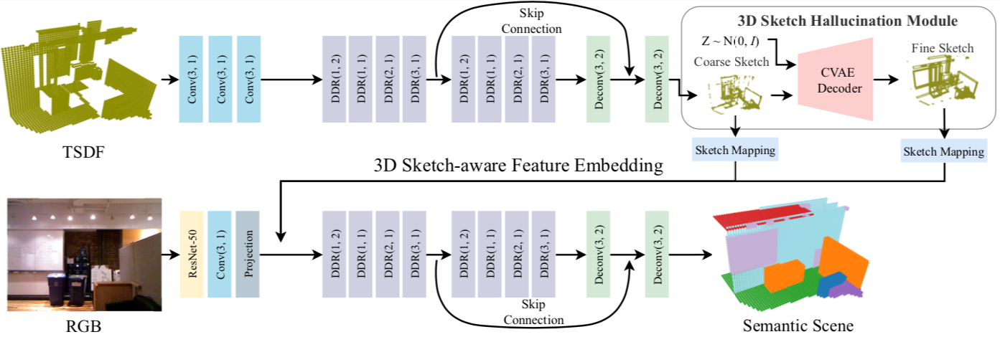

# TorchSSC
 

Implement some state-of-the-art methods of Semantic Scene Completion (SSC) task in PyTorch.


## Highlights:

- **Distributed training**
- **Easy-to-modify benchmark code**
- **High performance**


## News

- 2020/07/28

  Code release for the paper **3D Sketch-aware Semantic Scene Completion via Semi-supervised Structure Prior**, *CVPR 2020*. [[arXiv]](https://arxiv.org/abs/2003.14052), [[Supplementary Material and Demo]](https://charlesCXK.github.io)


## Performance

#### NYU

| Method                    | Resolution   | Trained on | SC IoU   | SSC mIoU |
| ------------------------- | ------------ | ---------- | -------- | -------- |
| SSCNet                    | (240, 60)    | NYU        | 55.1     | 24.7     |
| VVNetR-120                | (120, 60)    | NYU+SUNCG  | 61.1     | 32.9     |
| DDRNet                    | (240, 60)    | NYU        | 61.0     | 30.4     |
| ForkNet                   | (80, 80)     | NYU        | 63.4     | 37.1     |
| CCPNet                    | (240, 240)   | NYU        | 63.5     | 38.5     |
| **SketchAwareSSC (Ours)** | **(60, 60)** | **NYU**    | **71.3** | **41.1** |


## Data Preparation && Environment Installation

#### Pretrained ResNet-50

Please download the pretrained ResNet-50 and then put it into `./DATA/pytorch-weight`.

|    Source    |                   Link                   |
| :----------: | :--------------------------------------: |
| BaiDu Cloud  | Link: https://pan.baidu.com/s/1wS1TozvS3cBdutsXRWUmUw  Key: 4g9u |
| Google Drive | https://drive.google.com/drive/folders/121yZXBZ8wV77WRXRur86YBA4ifJEhsJQ?usp=sharing |

#### NYU Depth V2

Please download NYU dataset and then put it into `./DATA/NYU`.

|    Source    |                   Link                   |
| :----------: | :--------------------------------------: |
| BaiDu Cloud  | Link: https://pan.baidu.com/s/1GfWqAbsfMp3NOjFcEnL54A Key: v5ta |
| Google Drive | https://drive.google.com/drive/folders/121yZXBZ8wV77WRXRur86YBA4ifJEhsJQ?usp=sharing |

#### Environment Installation

Please refer to [this documentation](./install.md)


## 3D Sketch-aware Semantic Scene Completion via Semi-supervised Structure Prior



#### Training and Inference

#### Training

Training on NYU Depth V2:

```shell
$ cd ./model/sketch.nyu
$ export NGPUS=2
$ python -m torch.distributed.launch --nproc_per_node=$NGPUS train.py -p 10097
```

- `-p` is the port number. It is about the distributed training. If you run more than one experiments in the same machine, you should set different ports for them.
- The tensorboard file is saved in ` sketch.nyu/log/tb/` directory.

#### Inference

Inference on NYU Depth V2:

```shell
$ cd ./model/sketch.nyu
$ python eval.py -e 200-250 -d 0-1 --save_path results
```

- Here, 200-250 means we evaluate on checkpoints whose ID is in [200, 250], such as epoch-200.pth, epoch-249.pth, etc. 
- The SSC predictions will be saved in `results/` and `results_sketch/`, the former stores the SSC predictions and the latter stores sketch preditcions. Performance will be written to `log/*.log`. You will expect `0.411@SSC mIoU` and `0.713@SC IoU`.


## Citation

If you find this work useful in your research, please consider cite:

```
@InProceedings{Chen_2020_SketchAwareSSC,
    author = {Chen, Xiaokang and Lin, Kwan-Yee and Qian, Chen and Zeng, Gang and Li, Hongsheng},
    title = {3D Sketch-aware Semantic Scene Completion via Semi-supervised Structure Prior},
    booktitle = {The IEEE Conference on Computer Vision and Pattern Recognition (CVPR)},
    month = {June},
    year = {2020}
}
```


## Acknowledgement

Thanks [TorchSeg](https://github.com/ycszen/TorchSeg) for their excellent project!


## TODO

- [ ] Code on more datasets (NYUCAD/SUNCG).
- [ ] More SSC models.


